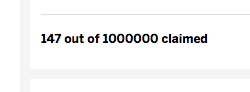

Yesterday, I posted about a gripe on not [pluralizing text](https://sencha.guru/2015/08/12/pluralize-text/) based on the value that text was associated to. Today, I visited a site and noticed some of their numbers were not formatted (some were). Once again, I was surprised how much this annoyed me...

You can see the '1000000' is not formatted, in fact I had to count a couple times to make sure I had enough zeros because my eyes were playing tricks on me when trying to count the number on the site. That's why you format the numbers! So your users don't have to struggle!

Once again, Ext JS to the rescue! `Ext.util.Format` has a `number` method that will take a value and a format string. The format string has quite a lot of options and luckily is pretty well [documented](https://docs.sencha.com/extjs/6.0/6.0.0-classic/#!/api/Ext.util.Format-method-number). Let's look at a simple example that will format that text correctly (least for my locale):

<iframe src="https://fiddle.sencha.com/fiddle/s3q?height=200" style="height:200px;width:600px;border:0;"></iframe>

As you can see, it outputs '1,000,000' and I can easily see what the actual value. Before formatting, it could have easily been 10,000,000 or 100,000 but now I know for sure it's 1,000,000. Let's look at usage in an `Ext.XTemplate`:

<iframe src="https://fiddle.sencha.com/fiddle/s3q?height=200" style="height:200px;width:600px;border:0;"></iframe>

Ext JS making it simple! Let's look at doing this in a grid, there's three ways to do it. Here's a grid with three columns that's doing it the three different ways:

<iframe src="https://fiddle.sencha.com/fiddle/s3s?height=400" style="height:400px;width:600px;border:0;"></iframe>

The first column has a renderer that uses `Ext.util.Format.number` directly, nothing really wrong with this but we can simplify this version by using `Ext.util.Format.numberRenderer` as in the second column. What the `numberRenderer` method does is basically returns a function and within this function uses `Ext.util.Format.number` just like in the first column. In fact, it's exactly the same thing, just a shorthand version. Those two are more for manual usage and backwards compatibility. The third column, for a grid, is the preferred way using `Ext.grid.column.Number` with a simple format config. Just like before, `Ext.grid.column.Number` just defines the `renderer` config for you and uses `Ext.util.Format.number` method just like in the first column.

When should you use one over the other. `Ext.grid.column.Number` was introduced in Ext JS 4.0 so if you are using Ext JS 3 or older, of course you cannot use it then, maybe you should update! :) The benefit of using `Ext.grid.column.Number` is it sets up the `updater` method on the column which means potential faster grid cell updates. I still use the other two when I need to use a different column but still need to format the number. For example, `Ext.tree.Panel` is actually just a grid but with a special column to show the expand and node icons. That means you have to use `Ext.tree.Column` and cannot use the `Ext.grid.column.Number` so you have to use one of the manual ways, like this:

<iframe src="https://fiddle.sencha.com/fiddle/s3u?height=400" style="height:400px;width:600px;border:0;"></iframe>

Here, we have to use the `treecolumn` so we can expand/collapse the Items node so we have to define the renderer. Since some `text` values may not be a number and therefore do not want to format them, I use a quick ternary to check if it's a number then format it, otherwise return it.
