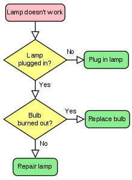

Through a lot of my professional life, I've been given steps. Sometimes I didn't get all steps or the steps weren't the most clear so I'd have to figure things out which is fine and in many cases I prefer. The more complex the steps were, the more I'd have to figure things out. I love the challenge; it's like a murder mystery. As I've grown in my roles, the less steps people give me and the more I have to pass down. Knowing that sometimes without proper direction, the project can be quite frustrating for some people. This is where flowcharts are a perfect tool to keep everyone on the same page.

## Flow what?

So what is a flowchart? Well, it's basically a picture of the individual steps (at any certain accuracy) with connectors between the steps to show the flow. [Wikipedia](https://en.wikipedia.org/wiki/Flowchart) has a great explanation as usual. In fact, here is a very simple flowchart from there:

As you can see above, each shape is a step and each step is connected with arrow connectors so you can see the flow of turning a lamp on. Now imagine if you apply this to a project or the flow of a particular feature within a project.

## When to flowchart, when to not

Normally I start with a high level flowchart at the beginning of the project without doing work first. I look at the project and get the overall view and build that chart. Usually, there are areas of the project that are more crucial (maybe even due to a deadline) that I need to drill in with another flowchart. You can really get as detailed and have as high project coverage as you want but I normally only focus on high level and crucial areas of a project. As the project goes on, I'll create more on the fly as I see where the project goes.

I wouldn't create a flowchart for everything, it can also be a waste of time. For example, the lamp flowchart above is really not needed, it's really too simple. It definitely depends on the project and what parts of that project are but starting high level and focusing on the crucial areas is a great start and drilling down as needed.

If someone is having a hard time understanding how something should work, a flowchart is a great visual way to explain things to get people on the same page. For example, I had a project where we had a tight deadline. I know most of it but there was a part where someone else know exactly how it's supposed to work. I created a flowchart for the overall flow and with that person's input on the part I didn't know, I was able to finish the flowchart so that everyone knew exactly how it works. Without a flowchart, it's was up to people describing how things work and in meetings (especially online meetings) people tend to drift off and miss parts of the meeting.

## Tools

So how do I create flowcharts? I've used [omnigraffle](https://www.omnigroup.com/omnigraffle) quite a bit before but have since moved onto [draw.io](https://www.draw.io/). What I like about draw.io (other than it's free) is that it's integrated into [Google Drive](https://drive.google.com/) and is just a well made web app. I've applauded them on their execution of this app, it's dead simple and automatically saves to Google Drive for me which also allows for other people to contribute (I haven't yet had multiple people working on the same chart at the same time). The only drawback is sharing, it shares the rendered flowchart but is usually quite small of a preview making me take screenshots to share.
